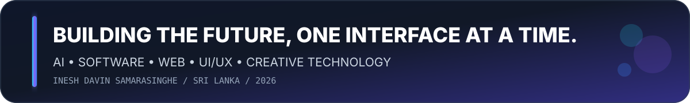
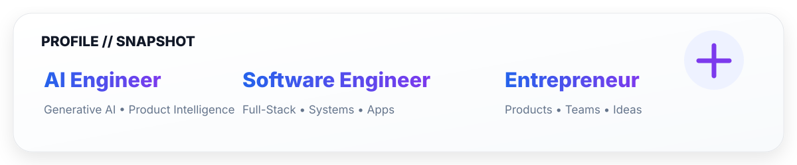
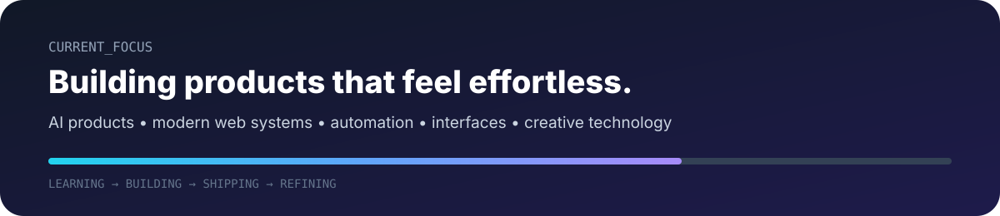
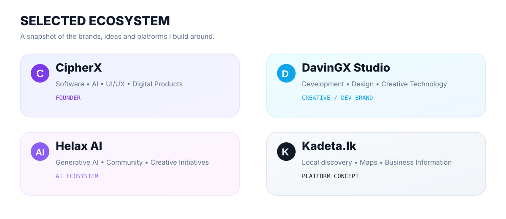

<!--
━━━━━━━━━━━━━━━━━━━━━━━━━━━━━━━━━━━━━━━━━━━━━━━━━━━━━━━━━━━━━━
  INESH DAVIN SAMARASINGHE
  GitHub Profile // 2026
  AI • SOFTWARE • PRODUCT • DESIGN
━━━━━━━━━━━━━━━━━━━━━━━━━━━━━━━━━━━━━━━━━━━━━━━━━━━━━━━━━━━━━━
-->

<div align="center">



<br/><br/>


<br/>

<a href="https://wa.me/ineshdavin">
  
</a>
<a href="https://github.com/idavingx-commits">
  
</a>


</div>

<br/>



---

## 01 / WHO I AM

<table>
<tr>
<td width="58%" valign="top">

### I build where engineering meets imagination.

I'm **Inesh Davin Samarasinghe** — an **AI Engineer, Software Engineer, Full-Stack Web Developer, UI/UX Designer, App Developer and Entrepreneur** from Sri Lanka.

I like taking a rough idea and turning it into something that feels:

**intentional • polished • fast • useful • memorable**

My work sits at the intersection of **AI, software, product design and creative technology**.

</td>
<td width="42%" valign="top">

```ts
const inesh = {
  role: [
    "AI Engineer",
    "Software Engineer",
    "Full-Stack Developer",
    "UI/UX Designer",
    "Entrepreneur"
  ],
  founder: "CipherX",
  studio: "DavinGX Studio",
  location: "Sri Lanka",
  mindset: "Build. Refine. Ship."
}
```

</td>
</tr>
</table>

<br/>



---

## 02 / THE STACK

<div align="center">


<br/><br/>


</div>

<br/>

<table>
<tr>
<td width="25%" valign="top">

### ⚛ Frontend
React  
Vite  
TypeScript  
JavaScript  
Tailwind CSS  
shadcn/ui  
Framer Motion

</td>
<td width="25%" valign="top">

### ◈ Backend
Node.js  
PHP  
MySQL  
REST APIs  
Auth Systems  
Dashboards  
Database Design

</td>
<td width="25%" valign="top">

### ✦ Creative
UI/UX  
Figma  
Graphics  
Motion  
Video  
3D  
Photography

</td>
<td width="25%" valign="top">

### ⬡ Exploring
Generative AI  
Automation  
Developer Tools  
Desktop Apps  
Unreal Engine  
Godot  
Creative Coding

</td>
</tr>
</table>

---

## 03 / HOW I BUILD

```text
                    ┌─────────────┐
                    │    IDEA     │
                    └──────┬──────┘
                           │
              ┌────────────▼────────────┐
              │   RESEARCH + STRATEGY   │
              └────────────┬────────────┘
                           │
           ┌───────────────▼────────────────┐
           │  PRODUCT THINKING + UX DESIGN  │
           └───────────────┬────────────────┘
                           │
               ┌───────────▼───────────┐
               │   BUILD + INTEGRATE   │
               └───────────┬───────────┘
                           │
                 ┌─────────▼─────────┐
                 │  TEST + OPTIMIZE  │
                 └─────────┬─────────┘
                           │
                     ┌─────▼─────┐
                     │   SHIP    │
                     └───────────┘
```

<div align="center">

**Think clearly. Design with purpose. Build with logic. Ship with quality.**

</div>

---

## 04 / SELECTED ECOSYSTEM



---

## 05 / THINGS I LIKE BUILDING

<div align="center">


</div>

<br/>

<table>
<tr>
<td width="33%" valign="top">

### PRODUCT SYSTEMS
- AI-powered applications
- Business platforms
- Admin dashboards
- LMS platforms
- Booking systems
- Customer portals
- Automation workflows

</td>
<td width="33%" valign="top">

### DIGITAL EXPERIENCES
- Responsive websites
- Product landing pages
- Interactive interfaces
- Modern web applications
- Mobile-first experiences
- Conversion-focused UI

</td>
<td width="33%" valign="top">

### CREATIVE TECHNOLOGY
- UI/UX design
- Graphic design
- Motion graphics
- Video production
- 3D animation
- Photography
- Game / simulation concepts

</td>
</tr>
</table>

---

## 06 / EDUCATION & LMS SYSTEMS

I design learning-platform concepts that can bring together:

| Students | Teachers | Administration |
|---|---|---|
| Registration | Class Management | User Management |
| Recordings | Zoom Integration | Payment Verification |
| Upcoming Classes | Marks & Results | Content Management |
| Learning Access | Progress Tracking | Dashboard Analytics |
| Parent Visibility | Resources | System Controls |

---

## 07 / GAME & INTERACTIVE

<div align="center">


<br/><br/>

**Unreal Engine • Godot • Unity • Blender**

<br/>

I’m interested in **immersive worlds, interactive simulations, space experiences and visually rich environments**.

</div>

---

## 08 / CREATIVE SIDE

<div align="center">


<br/><br/>

**DGames Studio • Rappite Kolla • ShaShiya GaMing • ZuZeter**

</div>

---

## 09 / GITHUB // LIVE METRICS

<div align="center">


<br/><br/>


<br/><br/>


</div>

---

## 10 / CONTRIBUTION FLOW

<div align="center">


<sub>If the snake is not visible yet, run the included GitHub Action once after uploading this pack.</sub>

</div>

---

## 11 / CURRENT SIGNAL

<div align="center">


</div>

---

## 12 / PRINCIPLES

<div align="center">

> ### Technology should feel powerful without feeling complicated.

<br/>


</div>

---

## 13 / CONNECT

<div align="center">

### Got an idea worth building?

<br/>

<a href="https://wa.me/ineshdavin">
  
</a>

<a href="https://github.com/idavingx-commits">
  
</a>

<br/><br/>


<br/><br/>

## Inesh Davin Samarasinghe

**AI Engineer • Software Engineer • Full-Stack Developer • UI/UX Designer • Entrepreneur**

**Founder — CipherX**  
**DavinGX Studio**

<br/>


</div>
